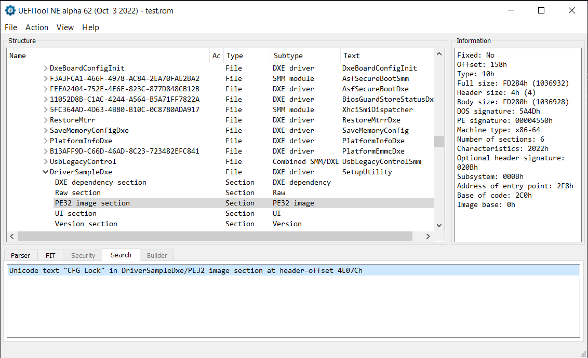
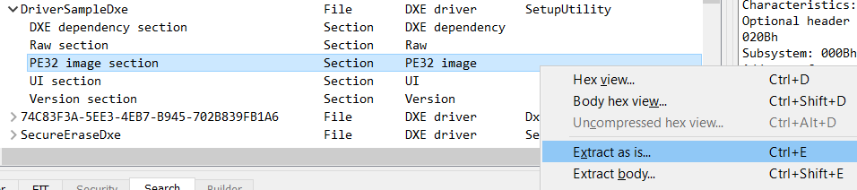
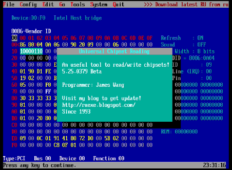
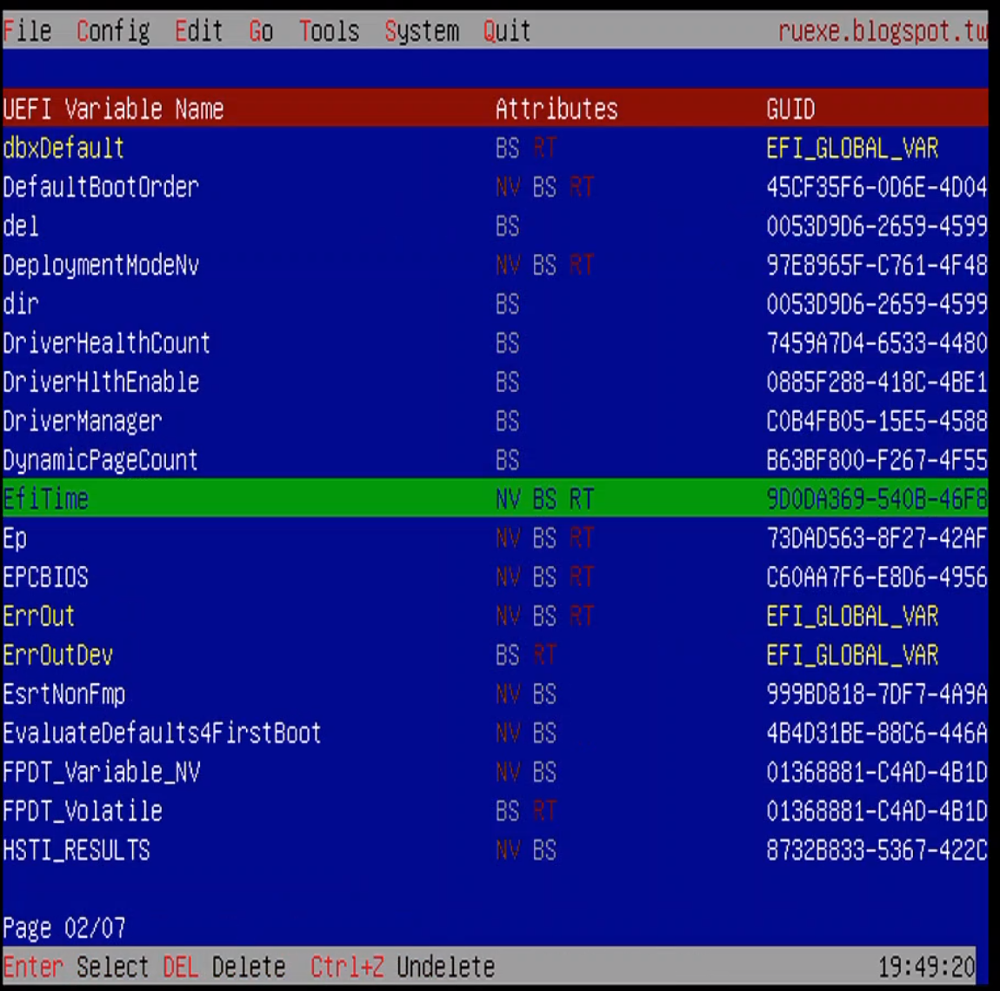
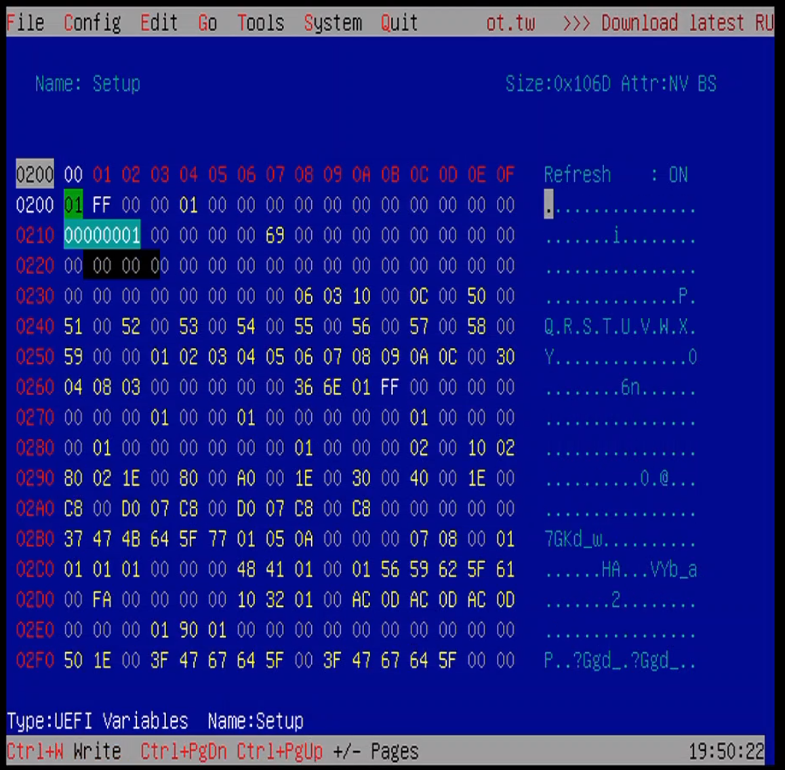

<!-- <style>
    .cb {
        border: solid grey 1px;
        border-radius: 10px;
        padding: 10px;
        font-family: Consolas, Monaco, Lucida Console, Liberation Mono, DejaVu Sans Mono, Bitstream Vera Sans Mono, Courier New;
    }
    .func {
        color: red;
    }
    .str {
        color: orange;
    }
    .num {
        color: deepskyblue;
    }
    .attr {
        color: seagreen;
    }
    .line {
        color: white;
    }
    .tab {
        padding: 0px 2rem;
        display: inline;
    }
</style> --> 
<!-- github doesnt support css -->

# tutorial or smth
*havent seen any step-by-step tutorial on this thing, esp. talking about the keyboard bug found in RU.efi so here it is*

1. dump your bios using [chipsec](https://github.com/chipsec/chipsec) (`chipsec spi dump bios.rom`)
2. open the rom up using [UEFITool](https://github.com/LongSoft/UEFITool)
3. search for `CFG Lock` to find out which driver? your bios setup utility is in

*my current bios has its setup utility in* ***DriverSampleDxe***

4. it should automatically expand the thing for you; select PE32 image section and select `Extract as is`


5. download the [ifrextractor](./ifrextractor) that i have attached for better compatibility (or just get it from [here](https://github.com/LongSoft/IFRExtractor-RS))

6. use it on the dumped bios.rom to extract the bios forms (`./ifr bios.rom bios.txt`)

7. it should generate a file called `bios.txt` (obv.) in which you'll find the following:

    - `String Packages` - basically the languages in which the bios ships with
    - `Form Sets` - pretty much all the tabs that the bios has (including hidden ones)
    - `Internal Forms Representation` - is the dumped forms, which interest us the most

8. now just search for the function you'd like to modify

9. after you've found it, it should be something like this:
<!-- <div class="cb">
    <span class="line">1.</span>
    <span class="func">One Of:</span>
    <span class="str">CFG Lock</span>,
     <span class="attr">VarStoreInfo (VarOffset/VarName):</span>
     <span class="num">0x3C</span>,
     <span class="attr">VarStore: </span>
     <span class="num">0x3</span>,
     QuestionId: 0x147,
     <span class="attr">Size:</span>
     <span class="num">1</span>,
     <span class="attr">Min:</span>
     <span class="num">0x0</span>,
     <span class="attr">Max:</span>
     <span class="num">0x1</span>,
     Step: 0x0 {...}
     <br/>
    <span class="line">2.</span>
    <div class="tab"/>
    <span class="func">One Of Option: </span>
    <span class="str">Disabled</span>,
    <span class="attr">Value (8 bit):</span>
    <span class="num">0x0</span> {...}
     <br/>
    <span class="line">3.</span>
    <div class="tab"/>
    <span class="func">One Of Option: </span>
    <span class="str">Enabled</span>,
    <span class="attr">Value (8 bit):</span>
    <span class="num">0x1</span>
    <span class="attr">(default)</span> {...}
    <br/>
    <span class="line">4.</span>
    <span class="func">End One Of</span> {29 02}
</div></div></div> <!--where the heck are these divs comming from???-->
<!--<br/> -->
```txt
One Of: CFG Lock, VarStoreInfo (VarOffset/VarName): 0x3C, VarStore: 0x3, QuestionId: 0x147, Size: 1, Min: 0x0, Max 0x1, Step: 0x0 {...}
  One Of Option: Disabled, Value (8 bit): 0x0 {...}
  One Of Option: Enabled, Value (8 bit): 0x1 (default) {...}
End One Of {29 02}
```

10. remember the offset (`0x3C` in my case) and the VarStore (`0x3` here)

11. scroll back up to the start of the `Internal Forms Representation` and you should see all the varstores listed there:

<!-- <div class="cb">
    <span class="line">1.</span>
    <span class="func">VarStore:</span>
    <span class="attr">VarStoreId:</span>
    <span class="num">0x3</span> [...],
    <span class="attr">Size:</span>
    <span class="num">0x1EC</span>,
    <span class="attr">Name:</span>
    <span class="str">CpuSetup</span> {...}
</div>
<br/> -->

```txt
VarStore: VarStoreId: 0x3 [...], Size: 0x1EC, Name: CpuSetup {...}
```

12. in this case, the actual UEFI variable is called `CpuSetup` (keep yours in mind)

13. download **SPECIFICALLY** [this RU.efi](./RU.efi) and one of [those SHELL.efi](./efi/boot/)

14. put both of them on a FAT32-formatted usb stick

15. connect external **USB** keyboard (must be USB; PS/2 and I2C keyboards break the RU.efi)

16. configure your bios to boot directly into the usb (DO NOT USING THE BOOT MENU IF YOU CAN; doing so can break RU.efi)

17. you're now booted into EFI shell!! go to ur usb drive (`FS0:` or wherever its mounted)

18. do an `ls` for good luck and then boot into `RU.efi`

19. you're now in RU.efI!!!!!



*RU.efi welcome screen*

20. press `ALT`+`=` to go into UEFI Variable mode.



21. start typing to search for your specific variable (in my case `CpuSetup`). if your variable is yellow then you're out of luck (read-only variable). if your variable does not exist then it's most likely limited to BIOS or your bios just didnt create it nor use it. (aka you're out of luck again)

22. select the variable and press `Enter`

23. you should now have a HEX view which shows `0x10` times on the left and `0x00`-`0x0f` on the top



*HEX view, not my photo*

24. go to your specific offset (for example `0x3C`) and modify it to your desire

25. when you're finished, press `CTRL`+`W` to write it to the VSS

26. press `ALT`+`Q` to leave RU.efi

27. exit out of shell and turn off your device

28. turn it on and your settings should be applied.

---

## sources & credits & stuff

[this amazing blogpost about RU.efi](https://nstarke.github.io/firmware/uefi/ru.efi/bios/2020/08/01/modifying-bios-using-ru-efi.html)

[official RU.efi website](http://ruexe.blogspot.com/)

probably some russian websites idk i didnt save them anywhere

this whole procedure took me 7 hours to discover due to the keyboard bug that no one else mentioned

if anyone finds out which function actually activates the advanced settings menu on HP, please lmk - i havent found it yet

weirdly enough, on HP, cfglock is enabled yet overclocking lock is disabled - although you cant even access it lol